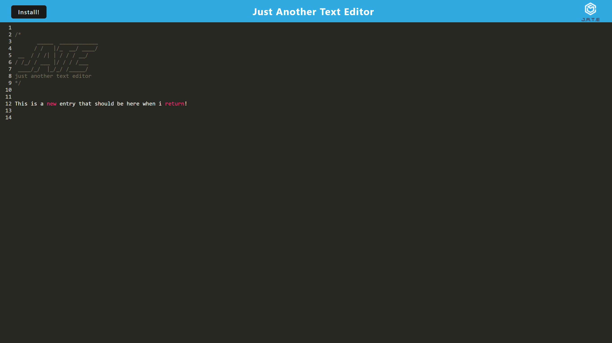

# Text Editor: A Progressive Web Applications

## Description

As a student learning how to code, creating this app has been a giant milestone reached. Creating an app that can is standalone and that can work offline and be downloaded is big feat. Although a simple text editor seems like an easy task, creating the front end and back end and having it function on its own is really cool.

## Table of Contents 

- [Installation](#installation})
- [Usage](#usage})
- [License](#license)
- [Contributing](#contributing)
- [Tests](#tests)
- [Questions](#questions)

## Installation

To install this app, all one must do is visit the deployed site https://b-alt-del-pwa-text-editor.herokuapp.com/ and press install

## Usage

Simply type text in the editor. Clicking off the page will automatically save the contents of the editor. When the app is closed and reopened the content will persist

## License

## Contributing

Feel free to make adjustments on the app and submit a pull request on my github (provided below)    

## Tests

Currently there are no tests, but i plan on making tests in the future    

## Questions

Contact one of the resources below with any questions

## Contact Info

